<picture>
  <source media="(prefers-color-scheme: dark)" srcset="./dark.svg">
  <source media="(prefers-color-scheme: light)" srcset="./light.svg">
  
</picture>

### Hey, I'm Sahil 👋

Full-stack developer building responsive, scalable web apps on the **MERN stack** — REST APIs, clean UIs, and the database work underneath. Currently building **DriveEase**, a peer-to-peer vehicle rental marketplace for Indian cities.

---

### ⚡ Focus

- **Full-stack web** — React front ends, Node.js / Express APIs, MongoDB data layers
- **Databases** — SQL and PL/SQL, alongside MongoDB, MySQL and PostgreSQL
- **Problem solving** — 150+ DSA problems solved across LeetCode and HackerRank

### 💼 Experience

**Cognizant — Healthcare Product Consulting (HPC) program**
SQL and PL/SQL on U.S. healthcare payer systems, working with TriZetto Facets.

### 🚀 Featured Projects

| Project | What it is | Built with |
| --- | --- | --- |
| **DriveEase** | Peer-to-peer vehicle rental marketplace for Indian cities | Next.js · Razorpay · PostHog · Vercel |
| [**README Craft**](https://github.com/Sahilgupta2175/github-readme-profile-generator) · [live](https://readme-craft-sg.vercel.app) | GitHub profile README generator with GitHub OAuth login | Full-stack JS |
| [**ChaiTailwind-CSS**](https://github.com/Sahilgupta2175/ChaiTailwind-CSS) | Tailwind-inspired utility-CSS compiler — reads HTML, extracts classes, emits CSS | Node.js, zero dependencies |
| [**Wanderlust**](https://github.com/Sahilgupta2175/Wanderlust) | Airbnb-inspired property rental platform with auth and bookings | Node.js · Express · MongoDB |
| [**InShare**](https://github.com/Sahilgupta2175/inshare-project) | File sharing via email or direct links | Node.js · Express · MongoDB |
| [**URL Shortener**](https://github.com/Sahilgupta2175/URL-Shortner) | Turns long URLs into short, shareable links | React · Vite · Node.js · MongoDB |
| [**Portfolio**](https://github.com/Sahilgupta2175/Sahil-Gupta-Portfolio) · [live](https://sahilgupta-sg.vercel.app) | Personal portfolio with EmailJS contact form and auto-reply | React · Vite · Tailwind CSS |

### 🛠️ Engineering Stack

  <picture>
    <source media="(prefers-color-scheme: dark)" srcset="https://skillicons.dev/icons?i=js%2Chtml%2Ccss%2Creact%2Credux%2Cnextjs%2Ctailwind%2Cbootstrap%2Cnodejs%2Cexpress%2Cmongodb%2Cmysql%2Cpostgres%2Cjava%2Cgit%2Cpostman%2Cvscode&theme=dark&perline=9">
    
  </picture>

### ✍️ Writing

I write about what I build on **[Hashnode](https://sahilxdev.hashnode.dev)**.

---

<h2 align="center">📊 GitHub Activity</h2>

  
  

  

  <picture>
    <source media="(prefers-color-scheme: dark)" srcset="https://raw.githubusercontent.com/Sahilgupta2175/Sahilgupta2175/output/github-snake-dark.svg">
    <source media="(prefers-color-scheme: light)" srcset="https://raw.githubusercontent.com/Sahilgupta2175/Sahilgupta2175/output/github-snake.svg">
    
  </picture>

---

<h2 align="center">📫 Connect</h2>

  
  
  
  

