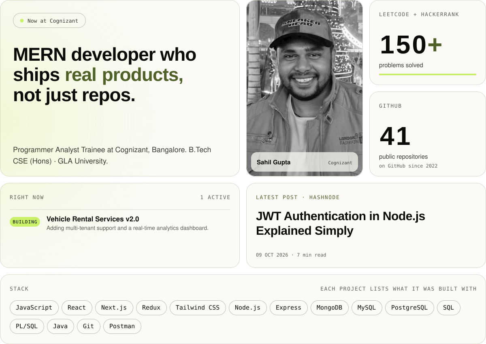

<!-- Generated by scripts/build.mjs from profile.config.mjs and live data. Edit those, not this file. -->

<picture><source media="(prefers-color-scheme: dark)" srcset="assets/hero-dark.svg"></picture>

<picture><source media="(prefers-color-scheme: dark)" srcset="assets/glance-dark.svg"></picture>

<picture><source media="(prefers-color-scheme: dark)" srcset="assets/title-work-dark.svg"></picture>
<picture><source media="(prefers-color-scheme: dark)" srcset="assets/project-1-dark.svg"></picture>
<a href="https://readme-craft-sg.vercel.app"><picture><source media="(prefers-color-scheme: dark)" srcset="assets/project-2-dark.svg"></picture></a>
<a href="https://github.com/Sahilgupta2175/ChaiTailwind-CSS"><picture><source media="(prefers-color-scheme: dark)" srcset="assets/project-3-dark.svg"></picture></a>
<a href="https://vrs-sg.vercel.app"><picture><source media="(prefers-color-scheme: dark)" srcset="assets/project-4-dark.svg"></picture></a>
<a href="https://wanderlust-sg.vercel.app"><picture><source media="(prefers-color-scheme: dark)" srcset="assets/project-5-dark.svg"></picture></a>
<a href="https://inshare-sg.vercel.app"><picture><source media="(prefers-color-scheme: dark)" srcset="assets/project-6-dark.svg"></picture></a>
<a href="https://github.com/Sahilgupta2175/URL-Shortner"><picture><source media="(prefers-color-scheme: dark)" srcset="assets/project-7-dark.svg"></picture></a>
<a href="https://sahilgupta.tech"><picture><source media="(prefers-color-scheme: dark)" srcset="assets/project-8-dark.svg"></picture></a>

<picture><source media="(prefers-color-scheme: dark)" srcset="assets/title-writing-dark.svg"></picture>
<a href="https://sahilxdev.hashnode.dev/jwt-authentication-in-node-js-explained-simply"><picture><source media="(prefers-color-scheme: dark)" srcset="assets/post-1-dark.svg"></picture></a>
<a href="https://sahilxdev.hashnode.dev/sessions-vs-jwt-vs-cookies-authentication"><picture><source media="(prefers-color-scheme: dark)" srcset="assets/post-2-dark.svg"></picture></a>
<a href="https://sahilxdev.hashnode.dev/store-and-serve-uploaded-files-express"><picture><source media="(prefers-color-scheme: dark)" srcset="assets/post-3-dark.svg"></picture></a>

<a href="https://sahilxdev.hashnode.dev">All posts on Hashnode →</a>

<picture><source media="(prefers-color-scheme: dark)" srcset="assets/title-activity-dark.svg"></picture>

<picture>
  <source media="(prefers-color-scheme: dark)" srcset="https://raw.githubusercontent.com/Sahilgupta2175/Sahilgupta2175/output/github-snake-dark.svg">
  
</picture>

<a href="https://sahilgupta.tech/#contact"><picture><source media="(prefers-color-scheme: dark)" srcset="assets/footer-dark.svg"></picture></a>

<a href="https://sahilgupta.tech">sahilgupta.tech</a> &nbsp;·&nbsp; <a href="https://www.linkedin.com/in/sahil-gupta-35199620a/">LinkedIn</a> &nbsp;·&nbsp; <a href="https://sahilxdev.hashnode.dev">Hashnode</a> &nbsp;·&nbsp; <a href="https://peerlist.io/sahilgupta2175">Peerlist</a> &nbsp;·&nbsp; <a href="mailto:guptasahil2175@gmail.com">Email</a>

Updated Mon, 12 Oct 2026 20:59 UTC from my portfolio's admin panel, Hashnode and GitHub.

